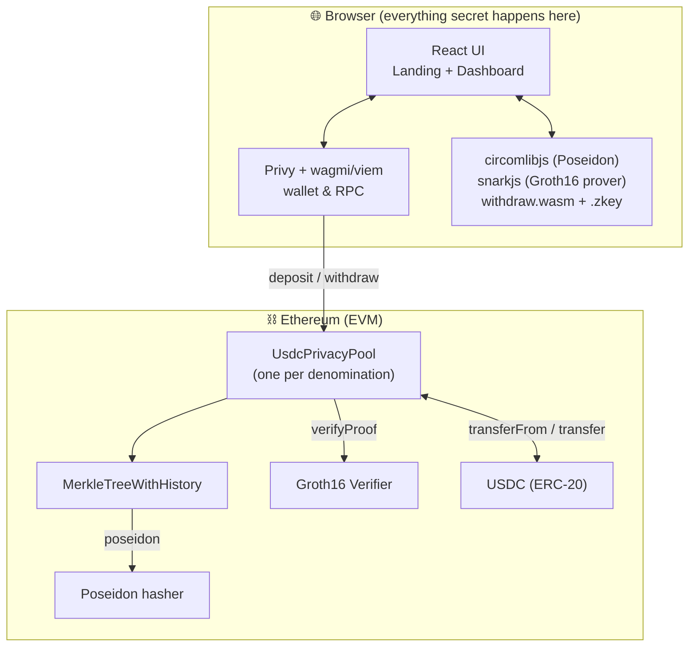

<div align="center">


# Aegis Protocol

### Zero-knowledge private USDC transfers on Ethereum

*Deposit a fixed amount of USDC. Get a secret note. Withdraw to a fresh address.*
*A zk-SNARK severs the on-chain link between sender and receiver — no custody, no intermediary, no record of who paid whom.*

<br/>

[](https://www.circle.com/usdc)
[](#-the-cryptography)
[](#-trust-assumptions)
[](#-license)

[](contracts/)
[](https://getfoundry.sh)
[](app/)
[](app/)
[](app/)
[](https://privy.io)

[](#-testing)
[](contracts/circuits)
[](#merkle-tree)
[](#%EF%B8%8F-security--compliance)

</div>

---

> [!WARNING]
> **Aegis Protocol is unaudited, experimental privacy software.** Withdrawals are **irreversible**. If you lose your note, your funds are **gone forever**. You are **solely responsible** for complying with all laws, sanctions, and tax rules in your jurisdiction. Test on a fork/testnet, get an independent audit before mainnet, and read [Security & Compliance](#%EF%B8%8F-security--compliance).

---

## 📑 Table of contents

- [What is Aegis?](#-what-is-aegis)
- [How it works](#-how-it-works)
- [The cryptography](#-the-cryptography)
- [Repository layout](#-repository-layout)
- [System architecture](#-system-architecture)
- [Smart contracts — code walkthrough](#-smart-contracts--code-walkthrough)
- [The circuit — code walkthrough](#-the-circuit--code-walkthrough)
- [Frontend — code walkthrough](#-frontend--code-walkthrough)
- [End-to-end flows](#-end-to-end-flows)
- [Quick start](#-quick-start)
- [Deploying](#-deploying)
- [Testing](#-testing)
- [Environment variables](#-environment-variables)
- [Security & compliance](#%EF%B8%8F-security--compliance)
- [Roadmap](#-roadmap)
- [License](#-license)

---

## 🛡️ What is Aegis?

Every transfer you make on Ethereum is public forever. Anyone can see that address `A` paid address `B`, how much, and when. Aegis breaks that link.

It is a **fixed-denomination shielded pool** for **USDC**, modelled on the Tornado-Cash construction and adapted for the ERC-20 token. The name fits: the *aegis* is the shield of Athena and Zeus in Greek myth — Aegis is, literally, a shield over your transfers.

The mechanism in one breath:

1. You **deposit** an exact amount of USDC (100, 1,000, or 10,000) and publish only a *hash* of a secret you keep.
2. Later, from **any** wallet, you prove **in zero knowledge** that you own one of the deposits in the pool — *without revealing which one* — and the pool releases the USDC to a fresh address.

Because every deposit in a pool is identical and the withdrawal can't be matched to any specific deposit, an observer cannot tell who paid whom. The more people use a pool, the stronger everyone's privacy.

> **Why fixed denominations?** If amounts varied, deposits and withdrawals could be matched by value and the anonymity would collapse. Uniform amounts make every deposit indistinguishable.

---

## 🔍 How it works

```mermaid
sequenceDiagram
    actor A as Alice (sender)
    participant Pool as Aegis Pool
    participant Tree as Merkle Tree
    actor B as Bob (recipient)

    rect rgb(8, 33, 66)
    Note over A: ① Generate secret note (in browser)
    A->>A: nullifier, secret = random
    A->>A: commitment = Poseidon(nullifier, secret)
    A->>Pool: approve + deposit(commitment) with 100 USDC
    Pool->>Tree: insert commitment as a leaf
    Pool-->>A: Deposit event (leafIndex)
    Note over A: ② Save the note offline 🔑
    end

    rect rgb(10, 35, 72)
    Note over B: ③ Later — from any wallet
    B->>B: rebuild Merkle path from on-chain logs
    B->>B: generate Groth16 proof (in browser)
    B->>Pool: withdraw(proof, root, nullifierHash, recipient=Bob)
    Pool->>Pool: verify SNARK + check root is known
    Pool->>Pool: mark nullifier spent (no double-spend)
    Pool->>B: transfer 100 USDC ✅
    end
```



- **Commitment** = `Poseidon(nullifier, secret)` — published on deposit. Hides the secret.
- **Nullifier hash** = `Poseidon(nullifier)` — revealed on withdraw. A spend-once tag that prevents double-spends.
- **Merkle root history** — the last 30 roots are kept, so a proof built against a slightly stale root still verifies.
- **No link** — the deposit transaction and the withdrawal transaction share nothing an observer can correlate.

---

## 🧠 The cryptography

Aegis is a classic **commitment + nullifier + Merkle membership** scheme proven with a **Groth16 zk-SNARK** over the BN254 curve, using the **Poseidon** hash (ZK-friendly, cheap inside circuits and on-chain).

### The note

A note is two 31-byte random field elements:

```
note = { nullifier, secret }
```

From them we derive:

| Value | Formula | Published when | Purpose |
|-------|---------|----------------|---------|
| `commitment` | `Poseidon(nullifier, secret)` | on **deposit** | the leaf stored in the tree; reveals nothing |
| `nullifierHash` | `Poseidon(nullifier)` | on **withdraw** | one-time spend tag; blocks double-spends |

### Merkle tree

Deposits are leaves of a height-**20** Merkle tree (capacity 2²⁰ = 1,048,576 deposits per pool), hashed pairwise with Poseidon. Empty subtrees use a precomputed chain of "zero" hashes derived from a fixed `ZERO_VALUE` domain constant. The contract keeps a **30-entry rolling history** of roots so proofs remain valid as the tree grows between a user reading state and submitting.

### The proof

On withdrawal, the circuit proves the statement:

> *"I know `(nullifier, secret)` such that `Poseidon(nullifier, secret)` is a leaf under Merkle root `R`, and `nullifierHash = Poseidon(nullifier)`"* — **without revealing `nullifier`, `secret`, or which leaf.**

The public inputs are `[root, nullifierHash, recipient, relayer, fee, refund]`. The recipient/relayer/fee/refund are **bound into the proof** (squared inside the circuit so the optimizer can't drop them) — so a relayer or front-runner **cannot change where the money goes**.

> **Token-agnostic by design.** The denomination is **never** a circuit input — it's enforced entirely by the contract (one pool per amount). That's why the exact same circuit, verifier, and proving key work for any token. Aegis reuses the proven artifacts unchanged; the ERC-20 adaptation is purely in Solidity.

---

## 📁 Repository layout

```
.
├── contracts/                      # Foundry project — Solidity, tests, deploy scripts
│   ├── src/
│   │   ├── UsdcPrivacyPool.sol      # ★ the pool: deposit / withdraw in USDC
│   │   ├── MerkleTreeWithHistory.sol# Poseidon Merkle tree + rolling root history
│   │   ├── Verifier.sol             # Groth16 verifier (snarkjs-generated, GPL-3.0)
│   │   ├── IHasher.sol              # Poseidon interface
│   │   └── IVerifier.sol            # verifier interface
│   ├── test/
│   │   ├── UsdcPrivacyPool.t.sol             # 17 unit tests (mocked hasher/verifier)
│   │   ├── UsdcPrivacyPoolIntegration.t.sol  # 1 end-to-end test w/ a REAL Groth16 proof
│   │   └── mocks/                            # MockUSDC, MockHasher, MockVerifier, ReentrantRecipient
│   ├── script/Deploy.s.sol         # deploys Poseidon + Verifier + 3 pools
│   ├── circuits/                   # withdraw.circom, merkleTree.circom + verification key
│   ├── poseidon-artifact/          # precompiled Poseidon hasher bytecode
│   └── foundry.toml
│
└── app/                            # React + Vite + TypeScript front end
    ├── src/
    │   ├── main.tsx                # Privy + wagmi providers, theme, wallet config
    │   ├── App.tsx                 # hash routing, theme state, cursor/magnetic FX
    │   ├── pages/
    │   │   ├── Landing.tsx         # the marketing site (hero, pipeline, FAQ…)
    │   │   └── Dapp.tsx            # ★ the dashboard: deposit / withdraw / pool stats
    │   ├── hooks/
    │   │   ├── useZK.ts            # loads Poseidon (circomlibjs)
    │   │   ├── useDeposit.ts       # note generation → approve → deposit
    │   │   ├── useWithdraw.ts      # merkle rebuild → snarkjs proof → withdraw
    │   │   ├── useUsdc.ts          # live USDC balance
    │   │   ├── usePoolStats.ts     # live anonymity-set size per pool (from chain)
    │   │   └── useReveal.ts        # scroll-reveal, count-up, magnetic-button FX
    │   ├── components/             # HeroCoin, HeroParticles, CoinMark, ThemeToggle, …
    │   ├── lib/eth.ts              # thin wagmi-actions adapter
    │   ├── config.ts               # networks, denominations, note format, pool addresses
    │   ├── abi.ts                  # ERC-20 + pool ABIs
    │   ├── wagmi.ts                # single-active-chain wagmi config
    │   └── auth.tsx                # Privy auth abstraction (+ preview mode)
    └── public/circuits/           # withdraw.wasm + withdraw_final.zkey + verification_key.json
```

---

## 🏗 System architecture



**Secrets never leave the browser.** Note generation and proof generation happen entirely client-side; the chain only ever sees commitments, nullifier hashes, and a succinct proof.

---

## 📜 Smart contracts — code walkthrough

### `UsdcPrivacyPool.sol` — the pool

The heart of the protocol. One instance is deployed **per denomination**. It is deliberately minimal and has **no admin, owner, pause, upgrade, or fund-recovery function** — funds can only ever leave through a valid withdrawal proof.

**State (all immutable except the spend/commit maps):**

```solidity
IVerifier public immutable verifier;     // Groth16 verifier for the withdraw circuit
IERC20    public immutable token;        // USDC
uint256   public immutable denomination; // exact amount, in base units (USDC = 6 decimals)

mapping(bytes32 => bool) public nullifierHashes; // spent notes
mapping(bytes32 => bool) public commitments;     // used commitments (dup guard)
```

**Deposit** — pulls *exactly* the denomination via `SafeERC20`, after inserting the leaf (checks-effects-interactions + `nonReentrant`):

```solidity
function deposit(bytes32 _commitment) external nonReentrant {
    require(!commitments[_commitment], "The commitment has been submitted");

    uint32 insertedIndex = _insert(_commitment);   // effects first
    commitments[_commitment] = true;

    token.safeTransferFrom(msg.sender, address(this), denomination); // interaction
    emit Deposit(_commitment, insertedIndex, block.timestamp);
}
```

There is **no `msg.value` path** — the exact-amount invariant is enforced by transferring precisely `denomination`. (USDC is not fee-on-transfer, so the pulled amount is exact.)

**Withdraw** — verifies the proof, marks the nullifier spent, and pays out in USDC:

```solidity
function withdraw(
    uint[2] calldata _pA, uint[2][2] calldata _pB, uint[2] calldata _pC,
    bytes32 _root, bytes32 _nullifierHash,
    address payable _recipient, address payable _relayer,
    uint256 _fee, uint256 _refund
) external payable nonReentrant {
    require(_fee <= denomination, "Fee exceeds transfer value");
    require(!nullifierHashes[_nullifierHash], "The note has been already spent");
    require(isKnownRoot(_root), "Cannot find your merkle root");
    require(msg.value == _refund, "Incorrect refund amount received by the contract");

    require(verifier.verifyProof(_pA, _pB, _pC, [
        uint256(_root), uint256(_nullifierHash),
        uint256(uint160(_recipient)), uint256(uint160(_relayer)), _fee, _refund
    ]), "Invalid withdraw proof");

    nullifierHashes[_nullifierHash] = true;                 // effects before interactions

    token.safeTransfer(_recipient, denomination - _fee);    // pay recipient in USDC
    if (_fee > 0) token.safeTransfer(_relayer, _fee);       // optional relayer fee in USDC
    if (_refund > 0) { /* optional ETH gas refund, funded by relayer */ }

    emit Withdrawal(_recipient, _nullifierHash, _relayer, _fee);
}
```

**Relayer / refund (optional).** A fresh address has no ETH for gas. A *relayer* can submit the withdraw for the user, take a `fee` in **USDC**, and forward an ETH `refund` (which it funds via `msg.value`) to the recipient. The recipient and amounts are bound inside the proof, so the relayer **cannot steal or redirect funds** — it can only choose whether to submit. The bundled UI does direct withdrawals (`fee = refund = 0`); relayer wiring is left as an integration point.

### `MerkleTreeWithHistory.sol` — the tree

An append-only Poseidon Merkle tree with a rolling history of roots.

- `_insert(leaf)` walks from the leaf to the root, hashing with `hashLeftRight` (which calls the Poseidon contract), updating `filledSubtrees`, and storing the new root in a 30-slot ring buffer (`roots`).
- `isKnownRoot(root)` scans the ring buffer — proofs built against any of the last 30 roots are accepted.
- `zeros(i)` returns the precomputed Poseidon "zero hash" for level `i` (empty-subtree value); `zeros(0)` is the `ZERO_VALUE` domain constant and `zeros(i) = Poseidon(zeros(i-1), zeros(i-1))`. The front end reads these directly from the contract, so its path reconstruction can never drift from on-chain state.

### `Verifier.sol` — Groth16 verifier

Auto-generated by **snarkjs** from the trusted-setup ceremony. Exposes `verifyProof(a, b, c, input[6])` and is **GPL-3.0** (header preserved). It is token- and denomination-agnostic, so it is reused unchanged.

### Interfaces & Poseidon

`IVerifier` / `IHasher` are the minimal ABIs the pool depends on. The Poseidon hasher itself is deployed from precompiled bytecode (`poseidon-artifact/PoseidonT3.json`) because Poseidon isn't practical to write in Solidity by hand.

---

## ⚡ The circuit — code walkthrough

`contracts/circuits/withdraw.circom` (circom 2.0, compiled to Groth16):

```circom
template CommitmentHasher() {
    signal input nullifier;
    signal input secret;
    signal output commitment;      // Poseidon(nullifier, secret)
    signal output nullifierHash;   // Poseidon(nullifier)
    // ...
}

template Withdraw(levels) {
    // public:  root, nullifierHash, recipient, relayer, fee, refund
    // private: nullifier, secret, pathElements[levels], pathIndices[levels]

    component hasher = CommitmentHasher();
    hasher.nullifier <== nullifier;
    hasher.secret    <== secret;
    hasher.nullifierHash === nullifierHash;          // enforce revealed tag

    component tree = MerkleTreeChecker(levels);       // enforce membership
    tree.leaf <== hasher.commitment;
    tree.root <== root;
    // ...path...

    // Bind recipient/relayer/fee/refund into the proof so they can't be tampered.
    signal recipientSquare; recipientSquare <== recipient * recipient;
    // (same for relayer, fee, refund)
}

component main {public [root, nullifierHash, recipient, relayer, fee, refund]} = Withdraw(20);
```

`merkleTree.circom` provides `MerkleTreeChecker`, which recomputes the root from the leaf and the `(pathElements, pathIndices)` authentication path using `Poseidon(2)` at each level and asserts it equals the public `root`.

> **Trusted setup.** `withdraw_final.zkey` and `Verifier.sol` come from a Groth16 Phase-2 ceremony. Treat the bundled artifacts as **inherited and unverified** — re-run the ceremony yourself before any production use (see [Security](#%EF%B8%8F-security--compliance)).

---

## 💻 Frontend — code walkthrough

A React 18 + Vite + TypeScript app. Wallets via **Privy** (embedded + external) over a **Privy-aware wagmi/viem** config. USDC-blue theme with light/dark modes, Fraunces + Inter + Space Mono type, scroll-reveal choreography, an animated "minted coin", and a particle field.

### Providers — `main.tsx`

Wraps the app in `PrivyProvider → QueryClientProvider → WagmiProvider`. Registers **only the active chain** so wagmi never pings other networks (avoids cross-origin RPC errors). On a local chain it restricts the wallet list to injected/EVM wallets; on real chains it shows the full list. Falls back to a **preview mode** (no Privy app id) that renders the full UI with wallet actions disabled.

### Deposit — `hooks/useDeposit.ts`

```ts
const nullifier = randomFieldBytes(31);
const secret    = randomFieldBytes(31);
const commitment = poseidon([F.e(nullifier), F.e(secret)]);     // circomlibjs
const note = `aegis-${chainId}-${denom}-${btoa(JSON.stringify({ nullifier, secret, commitment, … }))}`;

// 1. ensure an EXACT-amount allowance, approve if needed
// 2. pool.deposit(commitment)   ← contract pulls `denomination` USDC
// 3. hand the note back to the user to save
```

### Withdraw — `hooks/useWithdraw.ts`

```ts
// 1. parse + validate the note (chain, denomination, prefix)
// 2. read Deposit logs → leaves; find our leaf index
// 3. read zeros(i) from the contract; rebuild the Merkle path
// 4. nullifierHash = Poseidon(nullifier); check it isn't already spent
// 5. snarkjs.groth16.fullProve(input, '/circuits/withdraw.wasm', '/circuits/withdraw_final.zkey')
// 6. pool.withdraw(pA, pB, pC, root, nullifierHash, recipient, 0, 0, 0)
```

The Merkle path is rebuilt **client-side** using the same Poseidon and the contract's own `zeros(i)`, then the integration test guarantees the JS-rebuilt root matches the on-chain root bit-for-bit.

### Live data — `hooks/usePoolStats.ts` & `useUsdc.ts`

`usePoolStats` counts `Deposit` events per pool to show each pool's **anonymity-set size** (and a meter in the deposit panel). `useUsdcBalance` reads the connected account's USDC, both **pinned to the supported chain** so they work before a wallet connects.

### `lib/eth.ts`

A small adapter over `wagmi/actions` (`readContract` / `writeContract` / `waitForTransactionReceipt`) that isolates a single brittle generics boundary between wagmi 2.19 and viem 2.52, keeping the hooks fully typed.

---

## 🔄 End-to-end flows

<details>
<summary><b>Deposit flow (click to expand)</b></summary>

1. User picks a denomination (100 / 1,000 / 10,000 USDC).
2. Browser generates `nullifier`, `secret`, computes `commitment = Poseidon(nullifier, secret)`.
3. App ensures an **exact-amount USDC allowance** for the pool (approve if needed).
4. App calls `deposit(commitment)`; the contract pulls `denomination` USDC and inserts the leaf.
5. App shows the **note** and prompts to copy/download it. **This is the only key to the funds.**

</details>

<details>
<summary><b>Withdraw flow (click to expand)</b></summary>

1. User pastes the note + a recipient address (any address; it needs no funds).
2. App reads `Deposit` logs, finds the commitment's leaf, reads `zeros(i)`, and rebuilds the Merkle path.
3. App computes `nullifierHash`, checks it isn't spent, then runs `snarkjs.groth16.fullProve` (~a few seconds, in-browser).
4. App submits `withdraw(...)`; the contract verifies the proof, marks the nullifier spent, and transfers USDC to the recipient.

</details>

---

## 🚀 Quick start

**Prereqs:** Node ≥ 18, [Foundry](https://getfoundry.sh) (`forge`, `anvil`), git.

### 1 — Contracts

```bash
cd contracts
forge install                 # forge-std + OpenZeppelin
cp .env.example .env          # then edit
forge build
forge test -vvv               # 18 tests, incl. a real-proof USDC withdrawal
```

### 2 — Front end

```bash
cd app
cp .env.example .env          # set VITE_PRIVY_APP_ID (dashboard.privy.io)
npm install
npm run dev                   # http://localhost:5174
```

The first screen **is** the app — `/#app` deep-links straight into the dashboard.

### 3 — Local end-to-end (uses real anvil)

```bash
# terminal 1
anvil
# terminal 2 — deploy mock USDC + 3 pools
cd contracts
PRIVATE_KEY=0xac09…ff80 forge script script/Deploy.s.sol:DeployScript \
  --rpc-url http://127.0.0.1:8545 --broadcast
```

Copy the printed pool addresses into `app/.env` (`VITE_LOCAL_POOL_*`), set `VITE_CHAIN_ID=31337`, connect MetaMask to the localhost network, import the anvil test key, and deposit.

---

## 🌐 Deploying

The deploy script deploys **Poseidon + Verifier + one pool per denomination** (100 / 1,000 / 10,000 USDC). The token is chosen by `USDC_ADDRESS`:

| Mode | `USDC_ADDRESS` | Notes |
|------|----------------|-------|
| **Mainnet / fork** | `0xA0b86991c6218b36c1d19D4a2e9Eb0cE3606eB48` | the canonical mainnet USDC (also present on a forked node) |
| **Testnet / local** | *(unset)* | deploys a 6-decimal `MockUSDC` you can freely mint |

```bash
# mainnet fork (real USDC) — recommended first
anvil --fork-url $MAINNET_RPC_URL
USDC_ADDRESS=0xA0b8…eB48 PRIVATE_KEY=… \
  forge script script/Deploy.s.sol:DeployScript --rpc-url http://127.0.0.1:8545 --broadcast
```

> **This repo never deploys to mainnet for you.** For mainnet, prefer a hardware-wallet flow over a raw key, and **only after an audit.**

---

## ✅ Testing

```bash
cd contracts && forge test        # 18 tests
forge lint src                    # static analysis
cd ../app && npm run typecheck && npm run build
```

| Area | What's covered |
|------|----------------|
| Deposit | requires ERC-20 allowance · pulls **exact** denomination · rejects duplicate commitments |
| Withdraw | transfers USDC to recipient · relayer fee · **double-spend / nullifier replay fails** · invalid root / proof / over-fee revert |
| Safety | **reentrancy blocked** (malicious recipient re-entering on the ETH refund) · ETH refund path + `msg.value` mismatch |
| End-to-end | **real Poseidon + real Groth16 proof** deposits and withdraws USDC — proving the unmodified circuit/verifier work for ERC-20 |

---

## 🔧 Environment variables

| Where | Var | Purpose |
|-------|-----|---------|
| contracts | `PRIVATE_KEY` | deployer key (throwaway for test/fork) |
| contracts | `MAINNET_RPC_URL` / `SEPOLIA_RPC_URL` | RPC endpoints |
| contracts | `USDC_ADDRESS` | real USDC for mainnet/fork; unset ⇒ deploy MockUSDC |
| app | `VITE_PRIVY_APP_ID` | **required** — Privy app id |
| app | `VITE_CHAIN_ID` | `1` mainnet · `11155111` Sepolia · `31337` local |
| app | `VITE_*_POOL_100/1000/10000` | deployed pool addresses |

All `VITE_*` values are **public** (shipped to the browser). Never put secrets there.

---

## 🛡️ Security & compliance

### Trust assumptions

1. **Trusted setup** — the Groth16 toxic waste must have been destroyed. The bundled artifacts are inherited/unverified; re-run the ceremony for production.
2. **No admin, by design** — no owner, pause, upgrade, or recovery. Nobody (including the deployer) can move pooled funds except via a valid proof. A feature *and* a risk: there is no recourse for mistakes or bugs.
3. **Note custody is on you** — the note is the *only* key. No reset, no support, no recovery. Treat it like cash.
4. **Withdrawals are final** — sending to a wrong/incapable address is irreversible.
5. **Relayers** — can censor or front-run *which* note they submit, but **cannot steal or redirect funds** (bound in the proof).
6. **Privacy is not automatic** — your anonymity is only as large as the pool. Reusing addresses, or correlating amounts/timing, can de-anonymize you. Funding gas from a doxxed address links you.
7. **Front-end / RPC trust** — a malicious host or RPC can censor or observe metadata (IP, timing). Proving is local; secrets never leave the page.

### Legal / compliance disclaimer

Provided for **research and educational purposes**, "**as is**", without warranty of any kind. Privacy tools may be **restricted, regulated, or illegal** in your jurisdiction, and interacting with certain pools may carry **sanctions exposure**. **You** — not the authors — are responsible for ensuring your use is lawful, including all applicable AML/KYC, sanctions (e.g. OFAC), securities, and tax obligations. **Do not use this software to facilitate illegal activity.** The authors accept no liability for any use.

> **Get an independent audit** of both the contracts *and* the trusted-setup artifacts before any mainnet deployment with real funds.

---

## 🗺 Roadmap

- [ ] Relayer network + UI for gasless withdrawals to fresh addresses
- [ ] Multi-chain EVM deployments (Base, Arbitrum, Optimism, Polygon) with their native USDC
- [ ] Re-run / document a public Phase-2 trusted-setup ceremony
- [ ] Independent security audit
- [ ] (Exploratory) A separate Solana program for USDC-SPL — a from-scratch protocol, not a port

---

## 📄 License

MIT for the code in this repository (see [`LICENSE`](LICENSE)), **except** `contracts/src/Verifier.sol`, which is snarkjs-generated and **GPL-3.0** (header preserved). Full attribution — including the upstream Tornado-style MIT protocol it derives from, OpenZeppelin, circomlib, and snarkjs — is in [`NOTICE`](NOTICE).

<div align="center">
<br/>
<sub>Built with zero-knowledge proofs and a healthy respect for irreversible transactions.</sub>
<br/>
<sub><b>Aegis Protocol</b> · non-custodial · permissionless · unaudited · use at your own risk</sub>
</div>
